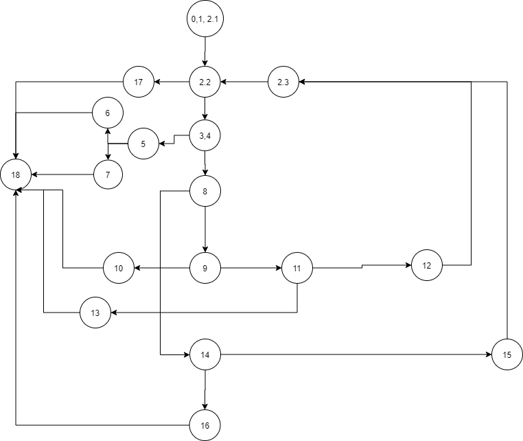
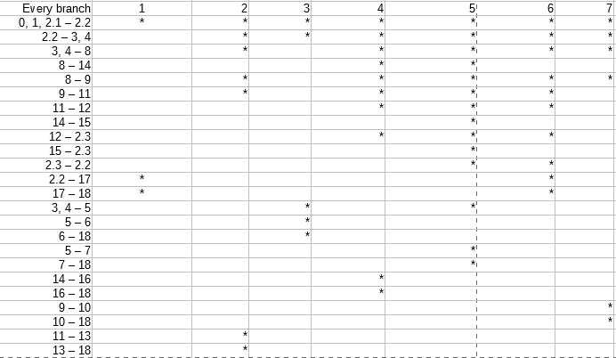

# Втора лабораториска вежба по Софтверско инженерство

## Христијан Тодоровски, бр. на индекс 163227

###  Control Flow Graph

### Цикломатска комплексност

Цикломатската комплексност на овој код е 7, истата ја добив преку формулата P+1, каде што P е бројот на предикатни јазли. Во случајoв P=6, па цикломатската комплексност изнесува 7.

### Тест случаи според критериумот Every branch

1. timeslist= empty
2. time1=22,40,60; time2=17,23,21; time3=23,14,32
3. time1=-25,40,30; time2=17,23,21; time3=23,14,32
4. time1=14,40,30; time2=17,23,21; time3=24,-14,32
5. time1=14,40,30; time2=24,0,0; time3=25,0,0
6. time1=14,40,30; time2=17,23,21; time3=23,14,32
7. time1=14,-10,30; time2=17,23,21; time3=23,14,32

### Објаснување на напишаните unit tests

